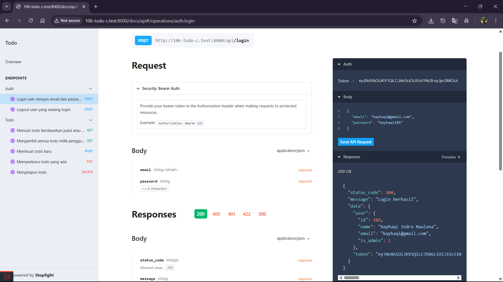
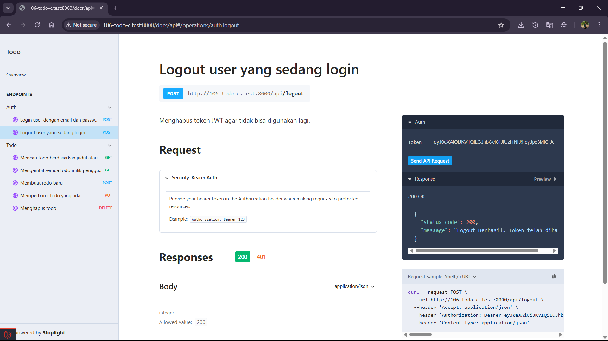
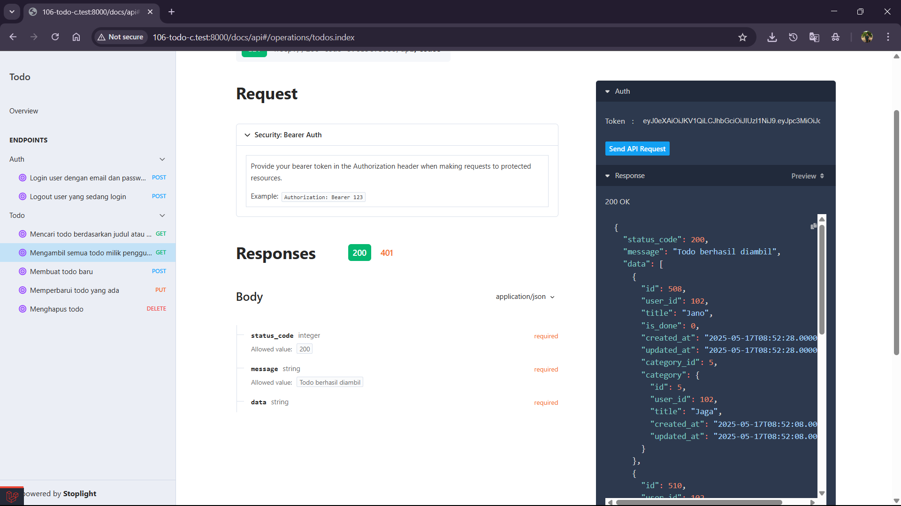
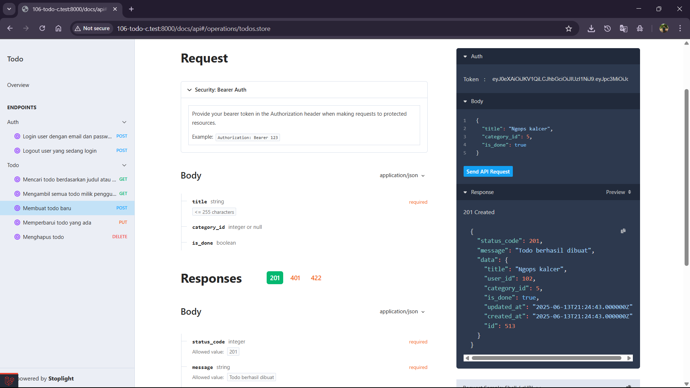
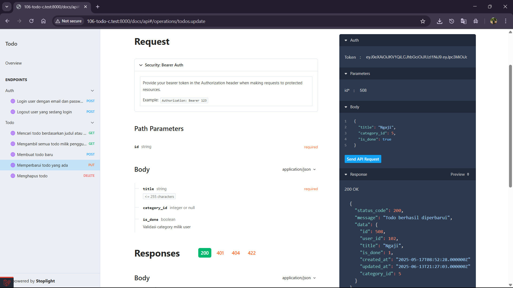
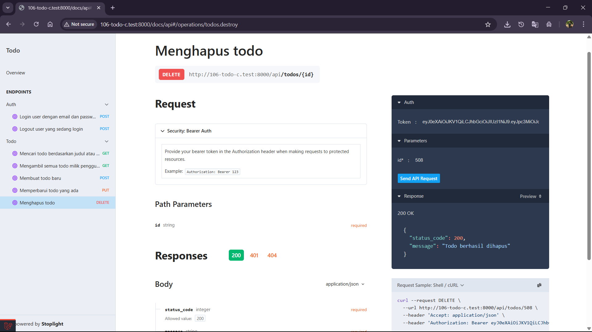
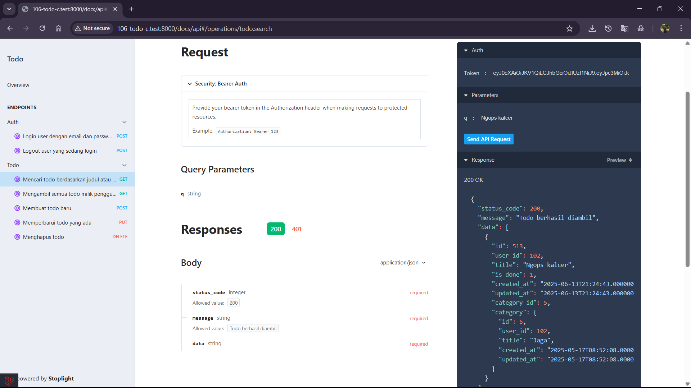

# Tugas12 - Logout, Create, Read, Search, Update dan Delete

## 1. Login

## 2. Logout

## 3. Endpoint untuk mengambil semua data Todo

## 4. Endpoint untuk menambah data Todo baru

## 5. Endpoint untuk mengubah Todo

## 6. Endpoint untuk menghapus Todo

## 7. Endpoint untuk melakukan pencarian pada Todo

